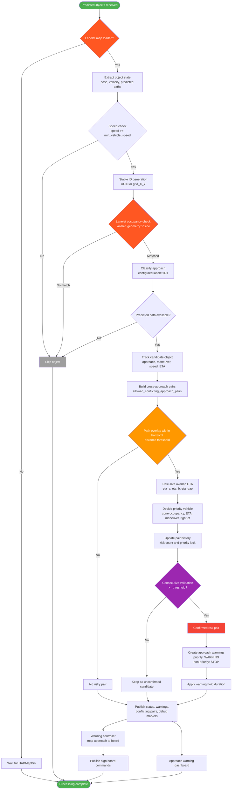

# crossline_collision_detector

## Overview

`crossline_collision_detector` is a ROS 2 package for infrastructure-based intersection collision risk analysis. It consumes Autoware predicted objects and a Lanelet2 vector map, classifies vehicles by configured intersection approaches, evaluates predicted path overlap, estimates ETA gaps, and publishes approach-level warning states for external warning devices.

The package is designed for intersection monitoring scenarios where roadside perception provides tracked vehicle objects and the system must decide which approach should proceed with caution and which approach should stop.

## Key Features

- Lanelet2-based approach classification from object position and configured approach lanelet IDs.
- Predicted path overlap detection within a configurable distance horizon.
- ETA gap calculation for conflicting vehicle pairs.
- Priority decision using conflict-zone occupancy, ETA ordering, maneuver priority, and right-of rules.
- Consecutive-frame validation to reduce unstable risk decisions.
- Priority locking and warning hold duration to prevent rapid warning flicker.
- Approach-level warning output: `SAFE`, `WARNING`, and `STOP`.
- Warning board command generation from approach warning states.
- RViz debug markers and an OpenCV approach warning dashboard.

## System Architecture



The runtime pipeline is composed of three ROS 2 component nodes:

- `intersection_risk_analyzer`: analyzes objects, Lanelet2 map data, conflicting paths, ETA gaps, and approach-level risk states.
- `warning_controller`: converts approach warning states into per-board warning device commands.
- `approach_warning_visualizer`: displays the current approach warning state in an OpenCV dashboard.

## Topic Interface

### `intersection_risk_analyzer`

| Direction | Default topic | Type | Description |
| --- | --- | --- | --- |
| Input | `/perception/object_recognition/objects` | `autoware_auto_perception_msgs/msg/PredictedObjects` | Tracked objects with velocity and predicted paths. |
| Input | `/map/vector_map` | `autoware_auto_mapping_msgs/msg/HADMapBin` | Lanelet2 vector map. The subscription uses transient local QoS. |
| Output | `/intersection_risk_analyzer/output/status` | `crossline_collision_detector/msg/IntersectionRiskStatus` | Summary of the current intersection risk state. |
| Output | `/intersection_risk_analyzer/output/approach_warnings` | `crossline_collision_detector/msg/ApproachWarningArray` | Per-approach `SAFE`, `WARNING`, or `STOP` state. |
| Output | `/intersection_risk_analyzer/output/conflicting_pairs` | `crossline_collision_detector/msg/ConflictingPairArray` | Detailed list of confirmed risky vehicle pairs. |
| Output | `/intersection_risk_analyzer/debug/markers` | `visualization_msgs/msg/MarkerArray` | RViz debug markers for warning and stop targets. |

### `warning_controller`

| Direction | Default topic | Type | Description |
| --- | --- | --- | --- |
| Input | `/intersection_risk_analyzer/output/approach_warnings` | `crossline_collision_detector/msg/ApproachWarningArray` | Per-approach warning states. |
| Output | `/warning_controller/output/sign_board_cmd` | `crossline_collision_detector/msg/WarningDeviceCommand` | Per-board command containing device ID, signal state, and active flag. |

### `approach_warning_visualizer`

| Direction | Default topic | Type | Description |
| --- | --- | --- | --- |
| Input | `/intersection_risk_analyzer/output/approach_warnings` | `crossline_collision_detector/msg/ApproachWarningArray` | Warning states rendered in the OpenCV dashboard. |

### Custom Messages

- `IntersectionRiskStatus`
  - `has_risk`: true when at least one confirmed conflicting pair exists.
  - `tracked_objects_count`: number of analyzed objects in the current frame.
  - `conflicting_pairs_count`: number of confirmed risky pairs.
  - `min_eta_gap`: minimum ETA gap among risky pairs.
  - `eta_gap_threshold`: configured ETA threshold.
  - `processing_time_ms`: processing time for the current frame.
- `ApproachWarningArray`
  - Contains a list of `ApproachWarning` messages for each configured approach.
- `ApproachWarning`
  - `approach_id`: output approach label.
  - `signal_state`: `SAFE`, `WARNING`, or `STOP`.
  - `reason`: reason for the state, such as `ETA_SAFE`, `PRIORITY_WARNING`, or `PRIORITY_STOP`.
  - `eta_gap`: ETA gap used for the warning decision.
- `ConflictingPairArray`
  - Contains confirmed risky `ConflictingPair` records.
- `ConflictingPair`
  - Includes object IDs, approach IDs, priority/non-priority object IDs, conflict zone ID, ETA values, ETA gap, and risk flag.
- `WarningDeviceCommand`
  - `device_id`: target warning board ID.
  - `signal_state`: display state for the board.
  - `active`: true when the board should be activated.

## Usage

### 1. Build

Build the package from the root of your ROS 2 workspace:

```bash
cd ~/workspace/my_ws
colcon build --symlink-install --packages-select crossline_collision_detector
source install/setup.bash
```

### 2. Configure the Intersection

Edit the parameter files before running the nodes:

- `config/intersection_risk_analyzer.param.yaml`
  - `conflict_zone_lanelet_ids`: lanelet IDs that define the conflict zone.
  - `approach_ids`: logical approach IDs such as `north`, `east`, `south`, and `west`.
  - `approach_<id>_lanelet_ids`: lanelet IDs belonging to each approach.
  - `approach_<id>_maneuver`: maneuver type, for example `straight`, `left_turn`, or `right_turn`.
  - `approach_<id>_right_of`: approach that has right-of-way relationship with this approach.
  - `allowed_conflicting_approach_pairs`: allowed cross-approach conflict pairs using `approach_a:approach_b`.
  - `eta_gap_threshold`: ETA gap threshold used for priority decisions.
  - `prediction_horizon_m`: predicted path distance horizon.
  - `path_overlap_distance_threshold`: maximum distance for path overlap detection.
  - `consecutive_count_threshold`: number of consecutive risky frames required for confirmation.
  - `warning_hold_duration_sec`: duration to keep warning states after risk disappears.
- `config/warning_controller.param.yaml`
  - `board_ids`: available warning board IDs.
  - `approach_<id>_board`: board assigned to each approach.
- `config/approach_warning_visualizer.param.yaml`
  - OpenCV dashboard layout and display labels.

### 3. Launch the Full Pipeline

```bash
ros2 launch crossline_collision_detector crossline_collision_detector.launch.xml
```

The default launch file expects:

- Object input: `/perception/object_recognition/objects`
- Vector map input: `/map/vector_map`
- Approach warning output: `/intersection_risk_analyzer/output/approach_warnings`

### 4. Launch Individual Nodes

Run only the risk analyzer:

```bash
ros2 launch crossline_collision_detector intersection_risk_analyzer.launch.xml
```

Run only the warning controller:

```bash
ros2 launch crossline_collision_detector warning_controller.launch.xml
```

Run only the OpenCV dashboard:

```bash
ros2 launch crossline_collision_detector approach_warning_visualizer.launch.xml
```

### 5. Remap Input Topics

Use launch arguments when your object, map, or approach warning topics are different:

```bash
ros2 launch crossline_collision_detector crossline_collision_detector.launch.xml \
  input_objects:=/your/perception/objects \
  input_vector_map:=/your/vector_map \
  approach_warnings_topic:=/your/intersection/approach_warnings
```

### 6. Inspect Outputs

```bash
ros2 topic echo /intersection_risk_analyzer/output/status
ros2 topic echo /intersection_risk_analyzer/output/approach_warnings
ros2 topic echo /intersection_risk_analyzer/output/conflicting_pairs
ros2 topic echo /warning_controller/output/sign_board_cmd
```

For RViz visualization, subscribe to:

```bash
/intersection_risk_analyzer/debug/markers
```
